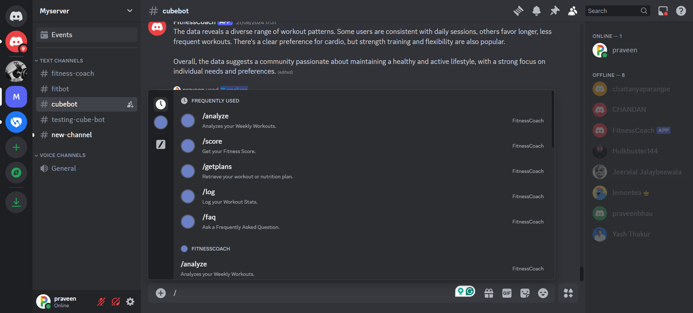

# Fitness Coach: Gemini Powered Discord Bot

This is a Discord bot that integrates with Google Generative AI, specifically the Gemini model, to provide advanced conversational capabilities. The bot is designed to assist users with fitness-related queries, workout and nutrition plans, habit tracking, and more.

## Features

- **Respond to User Messages:** Uses Google Generative AI to respond intelligently to user messages.
- **Conversation History:** Maintains and manages conversation history for each user.
- **Slash Commands:**
  - `/clear`: Clears the conversation history for the current user.
  - `/save`: Saves the conversation history and sends it to the user's inbox.
  - `/logs`: Logs important events and interactions into a database.
  - `/analyze <option>`: Analyzes the user's workout data and sends a detailed PDF report via DM. Options include `individual` and `community`.
  - `/getplans`: Retrieves and sends the user's current workout and nutrition plans.
  - `/faq`: Provides answers to frequently asked questions about fitness and the bot's functionalities.
  - `/score`: Provides scores for momentum, daily streak, and max streak for habit tracking.
- **Presence Status:** Automatically changes the bot's presence status every 30 seconds.
- **Workout Reminders:** Sends reminders to users if they miss their workout sessions, offering motivation to stay on track.
- **ICS File Generation:** Generates ICS files for workout and nutrition plans, with daily events reflecting the current date.

## Screenshots




## Fitness Coach: Gemini Powered Discord Bot Setup Guide

This guide will walk you through the process of setting up and running the Fitness Coach Discord Bot on your own server.

**Requirements:**

- Node.js and npm (or yarn) installed on your system.
- A Discord account and a server where you have administrator permissions.
- A Google account with access to the Generative AI API and a valid API key.

**Steps:**

1. **Clone the Repository:**
    - Open a terminal or command prompt and navigate to the directory where you want to store the bot's files.
    - Clone the repository using git:

    ```bash
    git clone https://github.com/praveensonesha/Discord-FitnessBot.git
    ```

    - Navigate to the newly created directory:

    ```bash
    cd Discord-FitnessBot
    ```

2. **Install Dependencies:**
    - Install the required dependencies using npm with legacy peer dependencies:

    ```bash
    npm install --legacy-peer-deps
    ```

    or

    ```bash
    yarn install
    ```

3. **Set up Environment Variables:**
    - Create a file named `.env` in the project's root directory.
    - Add the following environment variables to the file, replacing the placeholders with your actual values:

    ```env
    DISCORD_BOT_TOKEN=YOUR_DISCORD_BOT_TOKEN
    DISCORD_CLIENT_ID=YOUR_DISCORD_CLIENT_ID
    GOOGLE_API_KEY=YOUR_GOOGLE_API_KEY

    # Fitness Coach Database
    DB_HOST_1=YOUR_DB_HOST_1
    DB_NAME_1=YOUR_DB_NAME_1
    DB_USERNAME_1=YOUR_DB_USERNAME_1
    DB_PASS_1=YOUR_DB_PASS_1

    # Cube Club Database
    DB_HOST_2=YOUR_DB_HOST_2
    DB_NAME_2=YOUR_DB_NAME_2
    DB_USERNAME_2=YOUR_DB_USERNAME_2
    DB_PASS_2=YOUR_DB_PASS_2

    ```

    - You can obtain your bot token and client ID from the [Discord Developer Portal](https://discord.com/developers/docs/intro).
    - The Google API key can be obtained from the [Google AI Studio](https://aistudio.google.com/).

4. **Deploy Slash Commands:**
    - This step is necessary if you want to use slash commands (e.g., /clear).
    - If you don't need slash commands, you can skip this step.
    - In the terminal, run the following command:

    ```bash
    node deploy-commands.js
    ```

    - This will register the slash commands with your Discord application.

5. **Start the Bot:**
    - In the terminal, run the following command to start the bot:

    ```bash
    node index.js
    ```

    - The bot will connect to Discord and be ready to interact with users.

**Interacting with the Bot:**

- **Direct Messages:** Send a direct message to the bot to start a conversation.
- **Mentions:** Mention the bot in a server channel to get its attention.
- **Slash Commands:** Use the `/clear` command to clear the conversation history, `/save` to save and send conversation history, `/logs` to log important events, `/analyze` to get detailed reports, `/getplans` to retrieve workout and nutrition plans, `/faq` to get answers to common questions, and `/score` to check habit tracking scores.

**Additional Notes:**

- You can customize the bot's behavior and responses by modifying the code in the `conversationManager.js` and `config.js` files.
- The `errorHandler.js` file contains basic error handling logic. You can extend it to implement more robust error handling.
- Make sure to keep your API keys and bot token secure. Do not share them publicly.
- Refer to the [Discord.js documentation](https://discord.js.org/docs/packages/discord.js/14.14.1) and the [Google Generative AI documentation](https://ai.google.dev/docs) for more information on the available features and options.

**Enjoy using the Fitness Coach: Gemini Powered Discord Bot!**

Please keep in mind that this project is a work in progress, and breaking changes or new features may be introduced in future updates.
